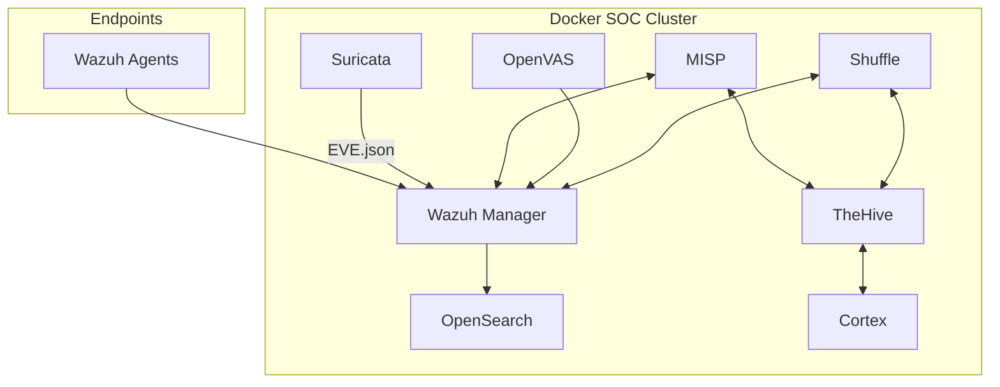

# 🛡 Unified Open-Source SOC Platform Blueprint

This document outlines the architecture and integration strategy for the Unified Open-Source SOC Platform.

## 🏗 Unified Architecture
The platform is designed to run as a Docker SOC Cluster, integrating multiple specialized security tools into a single orchestration layer.

## 🔵 Core SIEM + XDR: Wazuh
- **Role:** Central Brain / Single-Pane-of-Glass.
- **Functions:** Log management, FIM, Vulnerability detection, Compliance, Agent-based monitoring.

## 🟢 Network IDS/IPS: Suricata
- **Role:** Network monitoring layer.
- **Integration:** Generates logs shipped via Filebeat to Wazuh for correlation.

## 🟣 Threat Intelligence: MISP
- **Role:** IOC management and feed synchronization.
- **Integration:** Matches IOCs in Wazuh and generates Suricata rules.

## 🟡 SOAR + Case Management: TheHive + Cortex
- **Role:** Incident response and case tracking.
- **Functions:** Analyst workflows, automated enrichment, malware sandboxing.

## 🔴 Vulnerability Management: OpenVAS
- **Role:** Asset scanning and risk scoring.
- **Integration:** Scan results fed back into Wazuh SIEM.

## 🧠 Automation Layer: Shuffle
- **Role:** Security orchestration.
- **Functions:** Blocking IPs, disabling users, automated enrichment.

## 🐳 Deployment Strategy
- **Network:** `soc_net` (Docker network).
- **Security:** TLS encryption, Reverse proxy (Nginx), RBAC.
