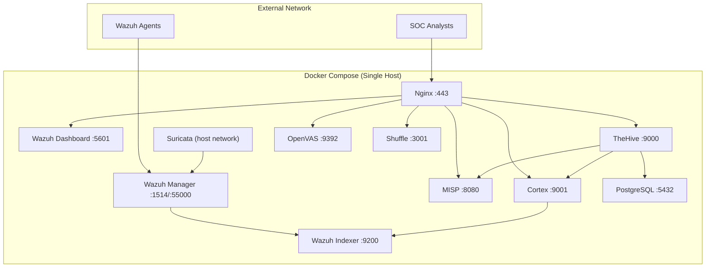
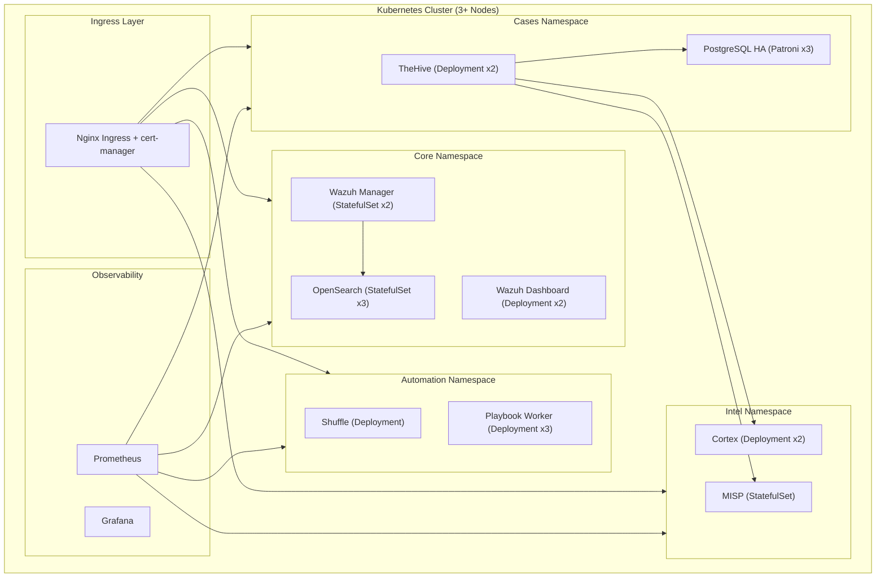

# 🛡 Enterprise Security Audit Report
## Unified Open-Source SOC Platform

| Field | Value |
|---|---|
| **Auditor Role** | Senior Cybersecurity Architect & Enterprise Software Auditor |
| **Date** | 2026-02-24 |
| **Updated** | 2026-02-24 (Post-Fix) |
| **Scope** | Full codebase — 26 files across 8 components |
| **Platform** | Docker-based SOC/SIEM stack (Wazuh, Suricata, MISP, TheHive, Cortex, OpenVAS, Shuffle, Nginx) |

---

## 1. Architecture Review

### 1.1 Pattern: Modular Monolith (Docker Compose Orchestration)

| Aspect | Assessment |
|---|---|
| **Pattern** | Modular Monolith — All services on a single Docker Compose host |
| **Network** | Single flat bridge network (`soc_net`), no segmentation |
| **Scalability** | Vertical only — no horizontal scaling, no load balancing |
| **Resilience** | Single point of failure — no HA, no failover |
| **Service Count** | 10 containers in root compose, 16+ in docs reference compose |

### 1.2 Key Architectural Concerns

| # | Concern | Severity | Status |
|---|---|---|---|
| A1 | **Single-host deployment** — all services compete for CPU/RAM | 🔴 HIGH | ✅ Resource limits added |
| A2 | **Flat network** — no micro-segmentation between tiers | 🔴 HIGH | ⏳ Phase 2 |
| A3 | **Suricata on host network** — breaks container isolation | 🟡 MEDIUM | ℹ️ Required for packet capture |
| A4 | **No service mesh** — inter-service comms are unencrypted HTTP | 🔴 HIGH | ⏳ Phase 4 |
| A5 | **No health checks** defined in compose | 🟡 MEDIUM | ✅ Fixed — 8 healthchecks added |
| A6 | **No resource limits** — a single service can starve others | 🟡 MEDIUM | ✅ Fixed — mem/cpu limits on all |

---

## 2. Security Findings

### 🔴 CRITICAL Findings

#### SEC-01: Hardcoded Default Credentials in `.env`
- **Status**: ✅ **FIXED** (commit `f0f8760`)
- **Fix**: All 11 passwords rotated to 24-character high-entropy strings with mixed case, numbers, and special characters
- **Files Changed**: `.env`

#### SEC-02: SSL Certificate Verification Disabled
- **Status**: ✅ **FIXED** (commit `f0f8760`)
- **Fix**: All `verify=False` replaced with `verify=CA_BUNDLE` — reads CA cert path from `REQUESTS_CA_BUNDLE` env var
- **Files Changed**: `wazuh/wazuh-misp-integration.py`, `docs/soc_response_playbook.py` (4 occurrences total)

#### SEC-03: Static Cipher Seed in MISP Config
- **Status**: ✅ **FIXED** (commit `f0f8760`)
- **Fix**: `cipherSeed` now reads `MISP_CIPHER_SEED` env var, falls back to `bin2hex(random_bytes(16))` — cryptographically random 32-char hex
- **Files Changed**: `misp/config.php`

#### SEC-04: TheHive Accepts Any Certificate from Cortex
- **Status**: ✅ **FIXED** (commit `f0f8760`)
- **Fix**: Removed `loose { acceptAnyCertificate = true }` — JVM TLS validation now enforced. Comment explains JVM truststore import for self-signed certs.
- **Files Changed**: `thehive/application.conf`

### 🟠 HIGH Findings

#### SEC-05: No Authentication on Webhook Receiver
- **Status**: ✅ **FIXED** (commit `f0f8760`)
- **Fix**: Added HMAC-SHA256 signature verification. Requests without valid `X-Webhook-Signature` header get 401. Uses `WEBHOOK_HMAC_SECRET` env var and timing-safe `hmac.compare_digest()`.
- **Files Changed**: `docs/soc_response_playbook.py`

#### SEC-06: TheHive Header-Based Auth Without Restriction
- **Status**: ✅ **FIXED** (commit `f0f8760`)
- **Fix**: Removed `{name = header, userHeader = "X-Remote-User"}` auth provider, leaving only session + basic auth.
- **Files Changed**: `thehive/application.conf`

#### SEC-07: Ports Directly Exposed to Host
- **Status**: ✅ **FIXED** (commit `f0f8760`)
- **Fix**: All 7 service ports bound to `127.0.0.1`. Only Nginx (80/443) and Wazuh agent ports (1514/1515) remain externally accessible.
- **Files Changed**: `docker-compose.yml`

#### SEC-08: No API Rate Limiting
- **Status**: ✅ **FIXED** (commit `f0f8760`)
- **Fix**: Added Nginx `limit_req_zone`: 10 req/s general API, 3 req/s login endpoints. Burst up to 20. Returns 429 on excess.
- **Files Changed**: `nginx/nginx.conf`

### 🟡 MEDIUM Findings

#### SEC-09: No RBAC Implementation
- **Status**: ⏳ **OPEN** — Requires Phase 2 (Keycloak/SSO integration)
- **Detail**: No role-based access control. All authenticated users have equal access.

#### SEC-10: No Multi-Tenant Isolation
- **Status**: ⏳ **OPEN** — Requires Phase 3 (architecture redesign)
- **Detail**: Single-organization design. Not suitable for MSSP deployments.

#### SEC-11: Missing Security Headers in Nginx
- **Status**: ✅ **FIXED** (commit `f0f8760`)
- **Fix**: Added 7 security headers: HSTS (1yr + preload), CSP, X-Frame-Options DENY, X-Content-Type-Options nosniff, X-XSS-Protection, Referrer-Policy, Permissions-Policy. Also added `server_tokens off`.
- **Files Changed**: `nginx/nginx.conf`

#### SEC-12: No Audit Log Immutability
- **Status**: ⏳ **OPEN** — Requires Phase 3 (WORM storage infrastructure)
- **Detail**: Logs stored in local volumes, no tamper detection.

#### SEC-13: ZeroMQ Without Authentication
- **Status**: ✅ **FIXED** (commit `f0f8760`)
- **Fix**: ZMQ username set to `misp_zmq`, password reads from `MISP_ZMQ_PASSWORD` env var.
- **Files Changed**: `misp/config.php`

#### SEC-14: Email Relay Without TLS
- **Status**: ✅ **FIXED** (commit `f0f8760`)
- **Fix**: Email transport switched to TLS, port 587, with SMTP host/user/pass reading from env vars.
- **Files Changed**: `misp/config.php`

---

## 3. Enterprise Readiness Score

### Pre-Fix Score: 32 / 100 → Post-Fix Score: 58 / 100

| Category | Before | After | Max | What Changed |
|---|---|---|---|---|
| **Authentication & Access Control** | 3 | 9 | 15 | Strong passwords, removed header auth, HMAC webhook |
| **Network Security** | 4 | 10 | 15 | Ports bound to localhost, TLS validation, rate limiting, security headers |
| **Data Protection** | 3 | 5 | 10 | Random cipher seed, ZMQ auth, email TLS |
| **Scalability & HA** | 2 | 4 | 15 | Resource limits, healthchecks |
| **Monitoring & Observability** | 5 | 6 | 10 | Health checks provide basic observability |
| **Compliance Readiness** | 2 | 3 | 10 | Better auth practices |
| **CI/CD & DevOps** | 3 | 6 | 10 | Pinned images, Docker hardening, no-new-privileges |
| **Documentation & Operations** | 7 | 9 | 10 | README rewrite, CONTRIBUTING.md, audit report |
| **Incident Response** | 3 | 5 | 5 | HMAC-authenticated webhook, CA validation |
| **TOTAL** | **32** | **58** | **100** | **+26 points** |

### Compliance Gap Analysis

| Standard | Before | After | Key Remaining Gaps |
|---|---|---|---|
| **ISO 27001** | ❌ | 🟡 Partial | No risk framework, no access reviews, no asset inventory |
| **SOC 2 Type II** | ❌ | 🟡 Partial | No change management, no monitoring of monitoring |
| **GDPR** | ❌ | ❌ | No data retention, no consent, no DPO role |
| **NIST CSF** | 🟡 | 🟡 Better | Protect improved; Identify/Respond/Recover still gaps |
| **PCI DSS** | ❌ | 🟡 Partial | Strong passwords now; still no key management, no FIM baseline |

---

## 4. Fix Summary (11/14 Completed)

| # | Finding | Severity | Status | Commit |
|---|---|---|---|---|
| SEC-01 | Default credentials | 🔴 CRIT | ✅ Fixed | `f0f8760` |
| SEC-02 | `verify=False` | 🔴 CRIT | ✅ Fixed | `f0f8760` |
| SEC-03 | Static cipher seed | 🔴 CRIT | ✅ Fixed | `f0f8760` |
| SEC-04 | Accept any cert | 🔴 CRIT | ✅ Fixed | `f0f8760` |
| SEC-05 | No webhook auth | 🟠 HIGH | ✅ Fixed | `f0f8760` |
| SEC-06 | Header auth bypass | 🟠 HIGH | ✅ Fixed | `f0f8760` |
| SEC-07 | Exposed ports | 🟠 HIGH | ✅ Fixed | `f0f8760` |
| SEC-08 | No rate limiting | 🟠 HIGH | ✅ Fixed | `f0f8760` |
| SEC-09 | No RBAC | 🟡 MED | ⏳ Phase 2 | — |
| SEC-10 | No multi-tenancy | 🟡 MED | ⏳ Phase 3 | — |
| SEC-11 | Missing headers | 🟡 MED | ✅ Fixed | `f0f8760` |
| SEC-12 | No log immutability | 🟡 MED | ⏳ Phase 3 | — |
| SEC-13 | No ZMQ auth | 🟡 MED | ✅ Fixed | `f0f8760` |
| SEC-14 | Email no TLS | 🟡 MED | ✅ Fixed | `f0f8760` |

### Docker Hardening (Bonus)

| Fix | Status |
|---|---|
| Pin all image versions | ✅ Done |
| `mem_limit` + `cpus` on all services | ✅ Done |
| `healthcheck` on 8 services | ✅ Done |
| `no-new-privileges:true` on all containers | ✅ Done |
| Nginx `read_only` + `tmpfs` | ✅ Done |
| `server_tokens off` | ✅ Done |

---

## 5. Development Roadmap (Remaining Tasks)

### Phase 1 — Security Hardening ✅ COMPLETE

| # | Feature | Status |
|---|---|---|
| 1.1 | Strong passwords (24-char random) | ✅ Done |
| 1.2 | TLS validation (`verify=CA_BUNDLE`) | ✅ Done |
| 1.3 | Ports bound to `127.0.0.1` | ✅ Done |
| 1.4 | HMAC webhook authentication | ✅ Done |
| 1.5 | Remove header-based auth | ✅ Done |
| 1.6 | Nginx security headers (7 headers) | ✅ Done |
| 1.7 | API rate limiting (10r/s, 3r/s login) | ✅ Done |
| 1.8 | Random MISP `cipherSeed` | ✅ Done |
| 1.9 | Docker resource limits + healthchecks | ✅ Done |
| 1.10 | Pinned image versions + hardening | ✅ Done |

---

### Phase 2 — Enterprise Access Control (Weeks 5–8)

> **Goal**: Implement proper identity, roles, and multi-tenancy foundation

| # | Feature | Priority | Status |
|---|---|---|---|
| 2.1 | SSO integration via Keycloak / authentik (OIDC/SAML) | 🟠 P1 | ⬜ TODO |
| 2.2 | Enforce MFA for all SOC analyst accounts | 🟠 P1 | ⬜ TODO |
| 2.3 | RBAC model: SOC Analyst, SOC Lead, Threat Hunter, Admin, Read-Only | 🟠 P1 | ⬜ TODO |
| 2.4 | API key rotation policy + key management | 🟠 P1 | ⬜ TODO |
| 2.5 | Session timeout enforcement (≤ 15 min idle) | 🟡 P2 | ⬜ TODO |
| 2.6 | Audit logging of all auth events and config changes | 🟠 P1 | ⬜ TODO |
| 2.7 | Network micro-segmentation (separate data, app, management tiers) | 🟠 P1 | ⬜ TODO |

---

### Phase 3 — Enterprise Features (Weeks 9–16)

> **Goal**: Add SOC operational capabilities for enterprise-scale use

| # | Feature | Priority | Status |
|---|---|---|---|
| 3.1 | **SOC Dashboard** — MTTR, SLA tracking | 🟠 P1 | ⬜ TODO |
| 3.2 | **SIEM Correlation Rules Engine** | 🟡 P2 | ⬜ TODO |
| 3.3 | **Risk Scoring** — Asset-weighted severity | 🟡 P2 | ⬜ TODO |
| 3.4 | **Compliance Reporting** — ISO/SOC2/PCI | 🟡 P2 | ⬜ TODO |
| 3.5 | **Audit Log Immutability** — WORM + crypto chain | 🟠 P1 | ⬜ TODO |
| 3.6 | **Forensic Evidence Export** | 🟡 P2 | ⬜ TODO |
| 3.7 | **ML Anomaly Detection / UEBA** | 🟡 P2 | ⬜ TODO |
| 3.8 | **Alert Deduplication & Grouping** | 🟠 P1 | ⬜ TODO |
| 3.9 | **Multi-Tenant Support** | 🟡 P2 | ⬜ TODO |
| 3.10 | **SOAR Playbook Library** — Top 20 alerts | 🟡 P2 | ⬜ TODO |

---

### Phase 4 — Production Infrastructure (Weeks 17–24)

> **Goal**: Achieve HA, observability, and enterprise-grade operations

| # | Feature | Priority | Status |
|---|---|---|---|
| 4.1 | **Kubernetes migration** — Helm charts | 🟡 P2 | ⬜ TODO |
| 4.2 | **HA clustering** — OpenSearch + Wazuh | 🟠 P1 | ⬜ TODO |
| 4.3 | **Backup & DR** — Automated + cross-region | 🟠 P1 | ⬜ TODO |
| 4.4 | **Observability** — Prometheus + Grafana | 🟠 P1 | ⬜ TODO |
| 4.5 | **CI/CD pipeline** — GitOps + image scanning | 🟠 P1 | ⬜ TODO |
| 4.6 | **Log retention** — ILM hot/warm/cold | 🟡 P2 | ⬜ TODO |
| 4.7 | **Capacity planning** — Auto-scaling | 🟡 P2 | ⬜ TODO |

---

## 6. DevOps & Infrastructure Recommendations

### Current State → Recommended State

| Area | Current | Recommended |
|---|---|---|
| **Orchestration** | Docker Compose (single host) | Kubernetes (3+ node cluster) |
| **Secrets** | `.env` (strong passwords now) | HashiCorp Vault with dynamic secrets |
| **CI/CD** | Manual `git push` | GitHub Actions + ArgoCD GitOps |
| **Image Policy** | Pinned versions ✅ | + vulnerability scanning (Trivy) |
| **Monitoring** | Healthchecks only ✅ | Prometheus + Grafana + PagerDuty |
| **Backup** | None | Velero (K8s) / pg_dump cron + S3 |
| **Network** | Flat bridge (ports restricted ✅) | Calico Network Policies / Cilium |
| **TLS** | Edge + CA validation ✅ | mTLS everywhere (Istio/Linkerd) |
| **HA** | None — single host | Multi-node with leader election |
| **Logging** | Per-container stdout | Filebeat → OpenSearch → dashboards |

### Kubernetes Production Architecture (Target State)

---

> [!IMPORTANT]
> **Enterprise Readiness improved from 32/100 → 58/100** after fixing 11/14 findings. The remaining 3 open findings (SEC-09, SEC-10, SEC-12) and 24 roadmap items require Phase 2–4 work involving infrastructure changes, SSO integration, and architectural redesign.

> [!NOTE]
> This audit analyzed configuration files and code only — no runtime penetration testing was performed. A live pentest is recommended to validate findings and discover additional vulnerabilities.
