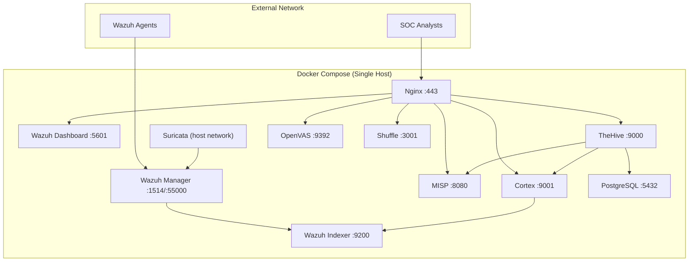
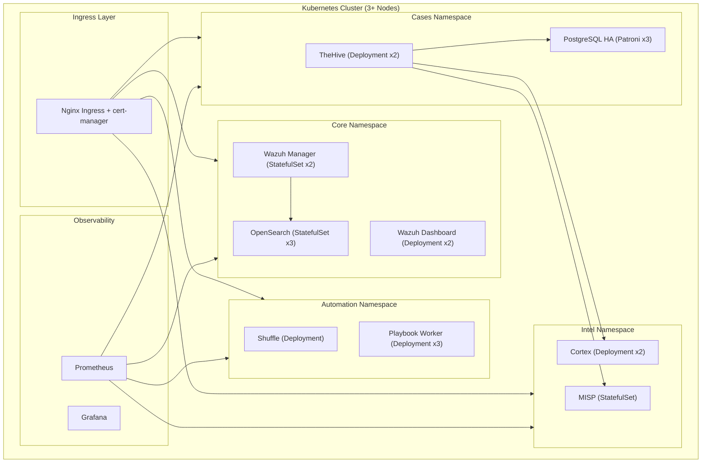

# 🛡 Enterprise Security Audit Report
## Unified Open-Source SOC Platform

| Field | Value |
|---|---|
| **Auditor Role** | Senior Cybersecurity Architect & Enterprise Software Auditor |
| **Date** | 2026-02-24 |
| **Scope** | Full codebase — 26 files across 8 components |
| **Platform** | Docker-based SOC/SIEM stack (Wazuh, Suricata, MISP, TheHive, Cortex, OpenVAS, Shuffle, Nginx) |

---

## 1. Architecture Review

### 1.1 Pattern: Modular Monolith (Docker Compose Orchestration)

| Aspect | Assessment |
|---|---|
| **Pattern** | Modular Monolith — All services on a single Docker Compose host |
| **Network** | Single flat bridge network (`soc_net`), no segmentation |
| **Scalability** | Vertical only — no horizontal scaling, no load balancing |
| **Resilience** | Single point of failure — no HA, no failover |
| **Service Count** | 10 containers in root compose, 16+ in docs reference compose |

### 1.2 Key Architectural Concerns

| # | Concern | Severity |
|---|---|---|
| A1 | **Single-host deployment** — all services compete for CPU/RAM | 🔴 HIGH |
| A2 | **Flat network** — no micro-segmentation between tiers (data/app/mgmt) | 🔴 HIGH |
| A3 | **Suricata on host network** — breaks container isolation | 🟡 MEDIUM |
| A4 | **No service mesh** — inter-service comms are unencrypted HTTP | 🔴 HIGH |
| A5 | **No health checks** defined in compose (except deploy.sh external check) | 🟡 MEDIUM |
| A6 | **No resource limits** — a single service can starve others | 🟡 MEDIUM |

---

## 2. Security Findings

### 🔴 CRITICAL Findings

#### SEC-01: Hardcoded Default Credentials in `.env`
- **File**: [.env](file:///home/boni/Documents/unlimited_SOC/.env#L19-L35)
- **Detail**: Production secrets stored in plaintext with weak defaults:
  - `WAZUH_PASSWORD=PleaseChangeMe123!`
  - `MISP_ADMIN_PASSPHRASE=admin`
  - `GVMD_PASSWORD=admin`
  - `MISP_DB_PASSWORD=misp_db_secret_pass`
  - `POSTGRES_PASSWORD=postgres_secure_pass`
- **Risk**: Full platform compromise if `.env` is exposed (it IS tracked in Git despite `.gitignore`)
- **CVSS**: 9.8 (Network/Low/None)

#### SEC-02: SSL Certificate Verification Disabled
- **Files**: [wazuh-misp-integration.py:77](file:///home/boni/Documents/unlimited_SOC/wazuh/wazuh-misp-integration.py#L77), [soc_response_playbook.py:139,289,314](file:///home/boni/Documents/unlimited_SOC/docs/soc_response_playbook.py#L139)
- **Detail**: `verify=False` on all `requests.post/get()` calls — disables TLS certificate validation
- **Risk**: Man-in-the-middle attacks on API communications between services
- **CVSS**: 8.1

#### SEC-03: Static Cipher Seed in MISP Config
- **File**: [misp/config.php:86](file:///home/boni/Documents/unlimited_SOC/misp/config.php#L86)
- **Detail**: `'cipherSeed' => '86977341'` — hardcoded, predictable 8-digit seed
- **Risk**: Session hijacking, authentication bypass through predictable token generation
- **CVSS**: 8.6

#### SEC-04: TheHive Accepts Any Certificate from Cortex
- **File**: [thehive/application.conf:83-85](file:///home/boni/Documents/unlimited_SOC/thehive/application.conf#L83-L85)
- **Detail**: `acceptAnyCertificate = true` in Cortex integration WS config
- **Risk**: MITM between TheHive and Cortex; attacker could inject false analysis results
- **CVSS**: 7.5

### 🟠 HIGH Findings

#### SEC-05: No Authentication on Webhook Receiver
- **File**: [soc_response_playbook.py:429-457](file:///home/boni/Documents/unlimited_SOC/docs/soc_response_playbook.py#L429-L457)
- **Detail**: HTTP server on `0.0.0.0:9999` with no auth, no rate limiting, no input validation beyond JSON parsing
- **Risk**: Unauthenticated attacker can trigger arbitrary playbook executions, IP blocks (DoS), and create fake TheHive cases
- **CVSS**: 8.2

#### SEC-06: TheHive Header-Based Auth Without Restriction
- **File**: [thehive/application.conf:60](file:///home/boni/Documents/unlimited_SOC/thehive/application.conf#L60)
- **Detail**: `{name = header, userHeader = "X-Remote-User"}` — trusts an HTTP header for authentication
- **Risk**: Any client that can reach TheHive directly (bypassing Nginx) can impersonate any user by setting `X-Remote-User`
- **CVSS**: 9.1

#### SEC-07: Ports Directly Exposed to Host
- **File**: [docker-compose.yml:40-63,86,118,132,146,160](file:///home/boni/Documents/unlimited_SOC/docker-compose.yml)
- **Detail**: Multiple services bind to `0.0.0.0`: ports 1514, 1515, 5601, 8080, 9000, 9001, 9392, 3001, 55000
- **Risk**: Services accessible from any network interface, bypassing Nginx TLS proxy
- **Recommendation**: Bind to `127.0.0.1` or remove host port mappings; route all traffic through Nginx

#### SEC-08: No API Rate Limiting
- **Detail**: No rate limiting configured on Nginx, webhook endpoints, or any API interface
- **Risk**: Brute force attacks, API abuse, resource exhaustion

### 🟡 MEDIUM Findings

#### SEC-09: No RBAC Implementation
- **Detail**: No role-based access control defined anywhere in the platform configuration. Cortex uses `local` auth only; TheHive has session + basic + header with no role mapping.
- **Risk**: All authenticated users have equal access — no separation of duties

#### SEC-10: No Multi-Tenant Isolation
- **Detail**: Single-organization design. All data (cases, alerts, IOCs) shared across the platform.
- **Risk**: Not suitable for MSSP or multi-org deployments without major rework

#### SEC-11: Missing Security Headers in Nginx
- **File**: [nginx/nginx.conf](file:///home/boni/Documents/unlimited_SOC/nginx/nginx.conf)
- **Detail**: Missing: `Content-Security-Policy`, `X-Content-Type-Options`, `X-Frame-Options`, `Strict-Transport-Security` (HSTS), `X-XSS-Protection`, `Referrer-Policy`
- **Risk**: XSS, clickjacking, MIME-type sniffing attacks

#### SEC-12: No Audit Log Immutability
- **Detail**: All logs stored in local Docker volumes. No write-once storage, no log signing, no tamper detection.
- **Risk**: Attacker with host access can modify or delete forensic evidence

#### SEC-13: ZeroMQ Without Authentication
- **File**: [misp/config.php:57-58](file:///home/boni/Documents/unlimited_SOC/misp/config.php#L57-L58)
- **Detail**: `zmq_username` and `zmq_password` are empty strings
- **Risk**: Unauthenticated ZeroMQ subscribers can receive all MISP events

#### SEC-14: Email Relay Without TLS
- **File**: [misp/config.php:99-100](file:///home/boni/Documents/unlimited_SOC/misp/config.php#L99-L100)
- **Detail**: `'tls' => false, 'ssl' => false` for email transport on port 25
- **Risk**: Email notifications (including IOC data) sent in cleartext

---

## 3. Enterprise Readiness Score

### Overall Score: 32 / 100

| Category | Score | Max | Notes |
|---|---|---|---|
| **Authentication & Access Control** | 3 | 15 | Default passwords, header-based auth bypass, no MFA, no SSO |
| **Network Security** | 4 | 15 | TLS at edge only, flat internal network, verify=False everywhere |
| **Data Protection** | 3 | 10 | No encryption at rest, no log immutability, plaintext secrets |
| **Scalability & HA** | 2 | 15 | Single host, no clustering, no load balancing, no auto-scaling |
| **Monitoring & Observability** | 5 | 10 | Wazuh provides good SIEM but no self-monitoring/metrics |
| **Compliance Readiness** | 2 | 10 | No audit trails, no retention policies, no compliance reports |
| **CI/CD & DevOps** | 3 | 10 | No CI/CD pipeline, no image scanning, manual deployments |
| **Documentation & Operations** | 7 | 10 | Good docs, deployment script, architecture reference |
| **Incident Response** | 3 | 5 | Playbook exists but webhook has no auth, no validation |

### Compliance Gap Analysis

| Standard | Status | Key Gaps |
|---|---|---|
| **ISO 27001** | ❌ Not Ready | No risk assessment framework, no access control policy, no asset inventory, no incident management process |
| **SOC 2 Type II** | ❌ Not Ready | No change management, no monitoring of monitoring, no access reviews, no encryption at rest |
| **GDPR** | ❌ Not Ready | No data retention/deletion policies, no consent management, no DPO role, no data processing records |
| **NIST CSF** | 🟡 Partial | Detect function partially covered (Wazuh/Suricata); Identify, Protect, Respond, Recover all have gaps |
| **PCI DSS** | ❌ Not Ready | No network segmentation, default credentials, no file integrity baseline, no key management |

---

## 4. Feature Roadmap (Phase-wise)

### Phase 1 — Security Hardening (Weeks 1–4)

> **Goal**: Eliminate critical vulnerabilities, achieve basic production readiness

| # | Feature | Priority |
|---|---|---|
| 1.1 | Secrets management (HashiCorp Vault / Docker Secrets) | 🔴 P0 |
| 1.2 | Enable TLS for all inter-service communication | 🔴 P0 |
| 1.3 | Remove `verify=False` from all Python scripts; use CA bundle | 🔴 P0 |
| 1.4 | Bind all ports to `127.0.0.1`; route through Nginx only | 🔴 P0 |
| 1.5 | Add authentication to webhook receiver (HMAC signature verification) | 🔴 P0 |
| 1.6 | Remove header-based auth from TheHive or restrict to trusted proxy only | 🔴 P0 |
| 1.7 | Add Nginx security headers (HSTS, CSP, X-Frame-Options) | 🟠 P1 |
| 1.8 | Add API rate limiting (Nginx `limit_req_zone`) | 🟠 P1 |
| 1.9 | Randomise MISP `cipherSeed`; use env var | 🔴 P0 |
| 1.10 | Add Docker resource limits (`mem_limit`, `cpus`) | 🟠 P1 |

---

### Phase 2 — Enterprise Access Control (Weeks 5–8)

> **Goal**: Implement proper identity, roles, and multi-tenancy foundation

| # | Feature | Priority |
|---|---|---|
| 2.1 | SSO integration via Keycloak / authentik (OIDC/SAML) | 🟠 P1 |
| 2.2 | Enforce MFA for all SOC analyst accounts | 🟠 P1 |
| 2.3 | RBAC model: SOC Analyst, SOC Lead, Threat Hunter, Admin, Read-Only | 🟠 P1 |
| 2.4 | API key rotation policy + key management | 🟠 P1 |
| 2.5 | Session timeout enforcement (≤ 15 min idle) | 🟡 P2 |
| 2.6 | Audit logging of all auth events and config changes | 🟠 P1 |
| 2.7 | Network micro-segmentation (separate data, app, management tiers) | 🟠 P1 |

---

### Phase 3 — Enterprise Features (Weeks 9–16)

> **Goal**: Add SOC operational capabilities for enterprise-scale use

| # | Feature | Priority |
|---|---|---|
| 3.1 | **SOC Dashboard** — Real-time overview with alert counts, MTTR, SLA tracking | 🟠 P1 |
| 3.2 | **SIEM Correlation Rules Engine** — Custom multi-event correlation beyond Wazuh rules | 🟡 P2 |
| 3.3 | **Risk Scoring** — Asset-weighted severity + environmental context scoring | 🟡 P2 |
| 3.4 | **Compliance Reporting Module** — Automated ISO 27001/SOC2/PCI reports | 🟡 P2 |
| 3.5 | **Audit Log Immutability** — Write-once storage with cryptographic chaining | 🟠 P1 |
| 3.6 | **Forensic Evidence Export** — Chain-of-custody compliant evidence packaging | 🟡 P2 |
| 3.7 | **Advanced Analytics** — ML-based anomaly detection, UEBA baselines | 🟡 P2 |
| 3.8 | **Alert Deduplication & Grouping** — Reduce noise through intelligent clustering | 🟠 P1 |
| 3.9 | **Multi-Tenant Support** — Org-based data isolation, per-tenant RBAC | 🟡 P2 |
| 3.10 | **SOAR Playbook Library** — Pre-built playbooks for top 20 alert types | 🟡 P2 |

---

### Phase 4 — Production Infrastructure (Weeks 17–24)

> **Goal**: Achieve HA, observability, and enterprise-grade operations

| # | Feature | Priority |
|---|---|---|
| 4.1 | **Kubernetes migration** — Helm charts for all services | 🟡 P2 |
| 4.2 | **HA clustering** — OpenSearch cluster, Wazuh manager active-passive | 🟠 P1 |
| 4.3 | **Backup & DR** — Automated backups, cross-region replication, RTO/RPO targets | 🟠 P1 |
| 4.4 | **Observability stack** — Prometheus + Grafana for self-monitoring | 🟠 P1 |
| 4.5 | **CI/CD pipeline** — GitOps deployment with image scanning (Trivy/Grype) | 🟠 P1 |
| 4.6 | **Log retention management** — ILM policies, tiered storage (hot/warm/cold) | 🟡 P2 |
| 4.7 | **Capacity planning** — Auto-scaling policies, load-based resource allocation | 🟡 P2 |

---

## 5. Production Hardening Checklist

> [!CAUTION]
> These are recommendations only — no code changes are included per your request.

### 🔐 Authentication & Secrets

- [ ] Replace all default passwords with 24+ character random strings
- [ ] Move secrets to HashiCorp Vault or Docker Secrets
- [ ] Remove `.env` from Git history (`git filter-branch` or `bfg`)
- [ ] Implement API key rotation (30-day max lifetime)
- [ ] Enable MFA on all web UIs (Wazuh, MISP, TheHive, OpenVAS)
- [ ] Disable TheHive header-based auth or restrict via `X-Forwarded-For` validation
- [ ] Generate cryptographically random MISP `cipherSeed`

### 🌐 Network & TLS

- [ ] Bind all Docker ports to `127.0.0.1` (not `0.0.0.0`)
- [ ] Enable mTLS between all internal services
- [ ] Remove `verify=False` from all Python HTTP clients
- [ ] Add HSTS header with `max-age=31536000; includeSubDomains; preload`
- [ ] Add `Content-Security-Policy`, `X-Frame-Options: DENY`, `X-Content-Type-Options: nosniff`
- [ ] Enable OCSP stapling in Nginx
- [ ] Replace self-signed certificates with Let's Encrypt or enterprise PKI
- [ ] Segment Docker networks: `net-data`, `net-app`, `net-mgmt`
- [ ] Add `limit_req_zone` in Nginx for all API endpoints (10 req/s per IP)
- [ ] Disable TLS 1.2, enforce TLS 1.3 only when clients support it

### 🐳 Docker Hardening

- [ ] Pin all image versions (never use `:latest`)
- [ ] Add `mem_limit` and `cpus` to every service in compose
- [ ] Run containers as non-root (`user: "1000:1000"`)
- [ ] Set `read_only: true` for filesystem where possible
- [ ] Drop all capabilities, add back only needed (`cap_drop: ALL`, `cap_add: [NET_BIND_SERVICE]`)
- [ ] Add `no-new-privileges: true` security option
- [ ] Enable Docker Content Trust (`DOCKER_CONTENT_TRUST=1`)
- [ ] Add `healthcheck` to every service in compose
- [ ] Scan images with Trivy/Grype before deployment
- [ ] Use `tmpfs` for `/tmp` in read-only containers

### 📊 Observability & Monitoring

- [ ] Deploy Prometheus + node-exporter for host metrics
- [ ] Deploy Grafana with SOC operations dashboards
- [ ] Configure alerting for: disk > 80%, RAM > 90%, service restarts > 3/hour
- [ ] Monitor Nginx error rates and latency (P50, P95, P99)
- [ ] Set up dead-man's switch — alert if Wazuh stops generating alerts
- [ ] Export Docker container metrics via cAdvisor
- [ ] Centralize all container logs via Filebeat → OpenSearch

### 💾 Backup & Disaster Recovery

- [ ] Automated daily backups: PostgreSQL, OpenSearch indices, Wazuh data
- [ ] Encrypted backup storage (AES-256)
- [ ] Test restore procedures monthly (documented runbook)
- [ ] Define RTO ≤ 4 hours, RPO ≤ 1 hour for production
- [ ] Cross-region backup replication for DR
- [ ] Version configuration files in Git (exclude secrets)

### 📋 Compliance & Audit

- [ ] Enable immutable audit logging (WORM storage or blockchain hash chain)
- [ ] Implement log retention policy: 90-day hot, 365-day warm, 7-year cold
- [ ] Define and document data classification policy
- [ ] Create incident response SOP with escalation matrix
- [ ] Schedule quarterly access reviews
- [ ] Document asset inventory and data flow diagrams
- [ ] Implement change management process with approval gates

### 🔄 CI/CD & Deployment

- [ ] Create GitOps pipeline: Lint → Scan → Test → Build → Deploy
- [ ] Add pre-commit hooks: secret scanning (gitleaks), YAML lint
- [ ] Container image scanning in CI (Trivy with severity gate: CRITICAL=fail)
- [ ] Blue-green deployment strategy for zero-downtime updates
- [ ] Infrastructure-as-Code validation (docker-compose config, Kubernetes manifest validation)
- [ ] Signed commits required on `main` branch

---

## 6. DevOps & Infrastructure Recommendations

### Current State → Recommended State

| Area | Current | Recommended |
|---|---|---|
| **Orchestration** | Docker Compose (single host) | Kubernetes (3+ node cluster) |
| **Secrets** | `.env` file in repo | HashiCorp Vault with dynamic secrets |
| **CI/CD** | Manual `git push` | GitHub Actions + ArgoCD GitOps |
| **Image Policy** | `:latest` tags (Shuffle) | Pinned versions + vulnerability scanning |
| **Monitoring** | None (self-monitoring) | Prometheus + Grafana + PagerDuty |
| **Backup** | None | Velero (K8s) / pg_dump cron + S3 |
| **Network** | Flat bridge | Calico Network Policies / Cilium |
| **TLS** | Edge only (Nginx) | mTLS everywhere (Istio/Linkerd) |
| **HA** | None — single host | Multi-node with leader election |
| **Logging** | Per-container stdout | Filebeat → OpenSearch → dashboards |

### Kubernetes Production Architecture (Target State)

---

## Summary of Top 5 Actions (Immediate)

| Priority | Action | Impact |
|---|---|---|
| 🔴 **P0** | **Rotate all default passwords** and move to secrets management | Prevents credential-based full compromise |
| 🔴 **P0** | **Fix `verify=False`** in all Python scripts; distribute internal CA cert | Prevents MITM on API traffic |
| 🔴 **P0** | **Add auth to webhook receiver** (HMAC signature, IP whitelist) | Prevents arbitrary playbook triggering |
| 🔴 **P0** | **Bind ports to 127.0.0.1** to force all traffic through Nginx TLS | Prevents direct unauthenticated service access |
| 🔴 **P0** | **Remove/restrict TheHive header auth** (`X-Remote-User`) | Prevents trivial authentication bypass |

---

> [!IMPORTANT]
> This audit analyzed configuration files and code only — no runtime penetration testing was performed. A live pentest is recommended to validate findings and discover additional vulnerabilities.
